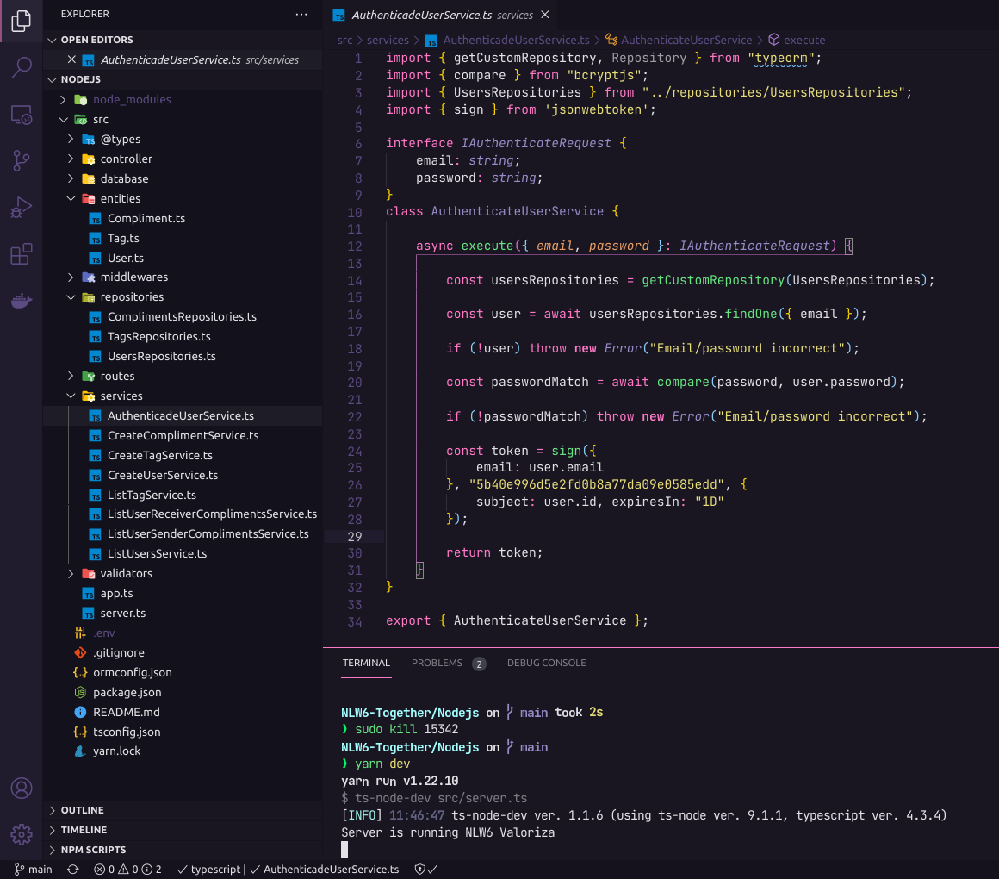

<h1 align="center">
			Valoriza
</h1>

  

  

  

## ✨ Tecnologias

Esse projeto foi desenvolvido com as seguintes tecnologias:

- [Node.js](https://nodejs.org/en/)
- [Typescript](https://www.typescriptlang.org/)
- [Express](https://expressjs.com/pt-br/)
- [JSONWebToken](https://github.com/auth0/node-jsonwebtoken#readme)

## 💻 Projeto

Valoriza é uma plataforma para promover o reconhecimento entre companheiros de equipe aplicação foi desenvolvida no NLW-Together 6 promovida pela [RocketSeat](https://rocketseat.com.br).

## 🚀 Como executar

- Clone o repositório
- Navegue até a pasta `/Nodejs`
- Rode `yarn` para baixar as dependências
- Rode `yarn typeorm migration:run` para criar as tabelas do banco de dados.
- Rode o `yarn dev` para iniciar a aplicação.

Por fim, a aplicação estará disponível em `http://localhost:3000`

## 📝 License

Este projeto está licenciado sob a Licença MIT. Consulte o arquivo [LICENSE](https://github.com/raphaelfeitosa/NLW6/blob/main/LICENSE.md) para obter detalhes.

## :rocket:Autor

Raphael Feitosa

 
